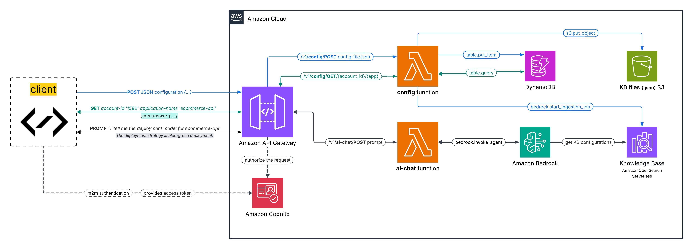

# AWS Lambda Hackathon - Configuration Store Engine

## Overview

**Problem statement**: As a DevOps engineer in a Cloud Platform team, managing configurations for various tools and pipelines can be challenging. These configurations are critical for providing customers access to AWS accounts and services such as Kubernetes (k8s) or GitHub Actions CI/CD pipelines.

The challenges include:
- Avoiding configuration drift and duplication
- Ensuring a centralized and scalable approach to configuration management
- Maintaining consistency across multiple environments

**Solution**: A Configuration Store Engine with AI capabilities, to provide a centralized, automated and intelligent solution for managing and interact with the configurations.

## Features and functionality

1. Authorization and authentication, by integrating Cognito with API Gateway as an authorizer.
2. Configuration management and AI Chat

```
├── /ai-chat 
│   └── POST - Bedrock AI agent to provide AI-driven responses based on the knowledge base
└── /config
    ├── POST - Stores configurations in DynamoDB and exports them to S3
    └── /{account_id}
        └── /{application_name}
            └── GET - Retrieves configurations from DynamoDB
```

3. Agentic AI from Bedrock integrated with Knowledge base with S3 data source
4. Knowledge Base Sync - Automatically triggers ingestion of new configurations into the Bedrock knowledge base

## Architecture



### Components

1. **AWS Cognito** - For secure access with client credentials, using machine to machine app client.
2. **API Gateway** - Provides two resource (```/config``` and ```/ai-chat```) for configuration management (```POST``` and ```GET```) and AI chat functionality.
3. **Lambda** - One function manages the configuration store operations, while another handles the Bedrock AI chat interaction to provide insights about the stored configurations.
4. **DynamoDB** - Stores JSON configurations as the single source of truth. Each item will get a unique version.
5. **Bedrock** - Provides AI-driven responses via an agent based on the linked Knowledge base.
6. **S3** - Stores exported configurations for Bedrock ingestion.


## Setup
Every infrastructure componenent part of the architecture diagram needs to be created and configured before using the solution. 

Resources to be created:
- Cognito user pool with m2m app client. Export ```client_id```, ```client_secret```, ```cognito_url``` and ```cognito_scope``` as environment variables.
- API Gateway can be imported directly using the ```hackathon-api-gw-v1-oas30-apigateway.json``` provided in the ```/api-gateway-export/``` directory.

## Usage

## Future Enhancements
